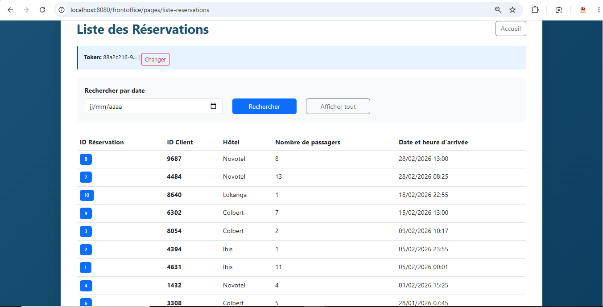

# Hotel FrontOffice - Module de Consultation Client 🏨 💻

[](#)
[](#)
[](#)
[](#)
[](#)

Le **FrontOffice** est le module orienté client et personnel d'accueil permettant la consultation en temps réel de l'état des réservations hôtelières et des planifications de navettes associées. Développé avec **Spring Web MVC 6**, il s'interface avec la base de données PostgreSQL commune.

---

## 🏗️ Architecture Technique (FO)

Le module suit l'architecture standard MVC structurée comme suit :

```
FrontOffice/
├── src/
│   ├── main/
│   │   ├── java/
│   │   │   └── com/
│   │   │       └── hotel/
│   │   │           ├── controller/       # Contrôleurs Spring MVC (Routage et requêtes)
│   │   │           ├── model/            # Modèles métier (Entités)
│   │   │           └── service/          # Couche Service & Accès Données
│   │   ├── resources/
│   │   │   └── database.properties       # Configuration de la BDD partagée
│   │   └── webapp/
│   │       ├── WEB-INF/
│   │       │   └── web.xml               # DispatcherServlet & Configuration Web
│   │       ├── pages/
│   │       │   ├── index.jsp             # Page d'accueil client
│   │       │   ├── liste-reservations.jsp# Affichage tabulaire des réservations
│   │       │   └── error.jsp             # Gestion des erreurs
│   │       └── js/                       # Scripts front-end
│   └── test/                             # Tests unitaires et d'intégration
├── build.bat                             # Script automatisé de compilation/déploiement
└── pom.xml                               # Fichier de build Maven
```

---

## 🛠️ Stack Technique

*   **Framework Core** : Spring Web MVC 6.1.4 (Inversion de contrôle, injection de dépendances).
*   **Java Runtime** : Java 17.
*   **Rendu Vues** : JSP (JavaServer Pages) & JSTL (JSP Standard Tag Library).
*   **Style & UI** : Bootstrap 5 pour un affichage responsive adapté aux mobiles et tablettes.
*   **Base de Données** : PostgreSQL 17 via JDBC.

---

## 💾 Installation & Lancement

Le FrontOffice nécessite l'exécution préalable des scripts SQL à la racine du projet (`base.sql` et `BackOffice/projet_hotel.sql`).

### 1. Compilation et déploiement automatique (Windows) :
Double-cliquez sur `build.bat` ou lancez-le dans votre invite de commande :
```cmd
build.bat
```
*Le script va nettoyer le projet, lancer le package Maven, compiler le WAR dans `target/frontoffice.war`, supprimer les anciennes versions dans Tomcat, et copier le nouveau livrable.*

### 2. Déploiement manuel (Toutes plateformes) :
```bash
# Compilation
mvn clean package

# Copie vers le répertoire Tomcat
cp target/frontoffice.war $TOMCAT_HOME/webapps/
```

### 🔗 Accès
Accédez à l'application via :
[http://localhost:8080/frontoffice/pages/](http://localhost:8080/frontoffice/pages/)

---

## 🔀 Workflow Git de l'Équipe

Ce module fait partie d'un workflow multi-dépôt impliquant :
*   Le développement sur des branches de type `Feature/` (ex. `Feature/Consultation`).
*   Une revue de code obligatoire et validation par le **Team Lead** via une **Merge Request (MR)** avant intégration sur `main`.
*   Le déploiement sur la branche `staging` pour validation locale avant la mise en production (`release/prod`).

*(Pour plus de détails sur le cycle d'intégration et les rôles de l'équipe, consultez le [README principal à la racine](../README.md)).*

---

## 📸 Screenshots


### Liste des réservations

